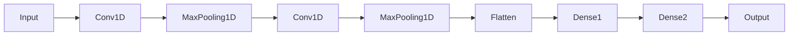
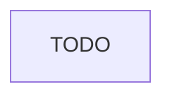

# Anomaly Detection in EEG

TODO: Link to thesis article

## Dataset

The dataset used in this work was the [CHB-MIT Scalp EEG Database](https://physionet.org/physiobank/database/chbmit/) from PhysioNet [1]. The exams in this dataset were generated at Boston Children's Hospital. All patients were monitored at a sampling rate of 256 Hz with 16-bit quantization, and the electrodes were placed according to the 10–20 system of the International Federation of Clinical Neurophysiology ([IFCN](https://www.ifcn.info/)). The dataset contains information from 23 patients, where each case contains between 9 and 42 continuous samples from a single subject.

The dataset comes with a summary for each patient, containing crucial details about the exams, such as file name, start and end times, and the number of seizures. Given the complexity and volume of files, we opted for a database solution to streamline access and enhance readability of this information.

After an analysis of the data contained in the summaries, we arrived at a relational table with the following information:

- Record name;
- File name;
- Initial time;
- End time;
- Number of seizures;
- Initial seizure times;
- Final seizure times;
- Number of channels;
- Channel names.

And the result is:

| record_name |  file_name   | start_time | end_time | nr_seizures | start_seizure | end_seizure | nr_channels |   ds_channels    |
| :---------: | :----------: | :--------: | :------: | :---------: | :-----------: | :---------: | :---------: | :--------------: |
|    chb01    | chb01_01.edf |  12:34:22  | 13:13:07 |      2      |  1862, 2000   | 1963, 2213  |     24      | FP1-F7,F7-T7,... |

To store the records of the table above, a MySQL database was used (https://www.mysql.com/), as it is simple to use and contains a Python library.

## [Database Configuration](https://github.com/luizantoniona/eeg-anomaly-detection/blob/main/database_configuration.ipynb)
- Creates the **database** based on the information from [database_info.py](https://github.com/luizantoniona/eeg-anomaly-detection/blob/main/database/database_info.py).
- Creates the **summary_info** table, designated to store summary information from the EEG's data.

## [Dataset Downloader](https://github.com/luizantoniona/eeg-anomaly-detection/blob/main/dataset_downloader.ipynb):
- Download the dataset from [CHB-MIT Scalp EEG Database](https://physionet.org/physiobank/database/chbmit/) and stores it at data/ directory

## [Dataset Database](https://github.com/luizantoniona/eeg-anomaly-detection/blob/main/dataset_database.ipynb):
- Is used to insert sample models to the database following the flowchart:
  

## [Dataset Preview](https://github.com/luizantoniona/eeg-anomaly-detection/blob/main/dataset_preview.ipynb):

## Pre-processing

## Model's Architecture

### CNN (Convolutional Neural Network)

   - TimeCNN:

- FrequencyCNN:

- TimeFrequencyCNN:

### RNN (Recurrent Neural Network)
- TimeRNN:

- FrequencyRNN:

- TimeFrequencyRNN:

### Transformer

### Data Domains
The data will be processed and inserted into the models in three different domains:

1. **[Time Domain](https://github.com/luizantoniona/eeg-anomaly-detection/blob/main/training_time.ipynb)**
   - Using raw data for training.

2. **[Frequency Domain](https://github.com/luizantoniona/eeg-anomaly-detection/blob/main/training_frequency.ipynb)**
   - Utilizing Power Spectral Density (Periodogram) for training.

3. **[Time-Frequency Domain](https://github.com/luizantoniona/eeg-anomaly-detection/blob/main/training_time_frequency.ipynb)**
   - Employing Spectrogram for training.

---

[1] Guttag J. CHB-MIT Scalp EEG Database (version 1.0.0). PhysioNet. 2010. Available from: https://doi.org/10.13026/C2K01R

---