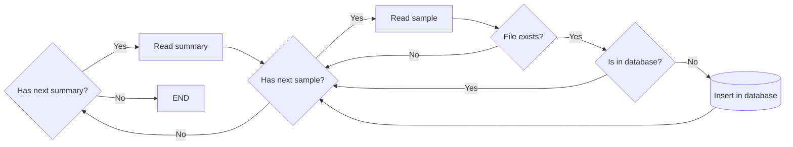
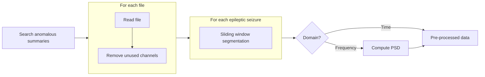
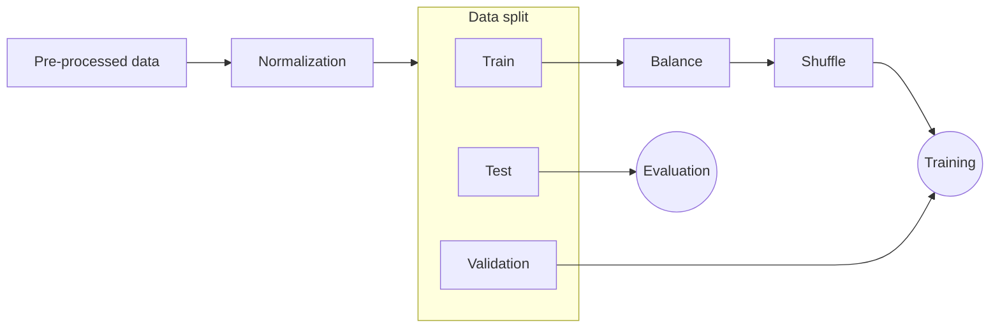

# Epileptic Seizure Detection in EEG

TODO: Link to thesis article

TODO: Thesis citation (when done, use it to reference this code)

## Dataset

The dataset used in this work was the [CHB-MIT Scalp EEG Database](https://physionet.org/physiobank/database/chbmit/) from PhysioNet [1]. The exams in this dataset were generated at Boston Children's Hospital. All patients were monitored at a sampling rate of 256 Hz with 16-bit quantization, and the electrodes were placed according to the 10–20 system of the International Federation of Clinical Neurophysiology ([IFCN](https://www.ifcn.info/)). The dataset contains information from 23 patients, where each case contains between 9 and 42 continuous samples from a single subject.

The dataset comes with a summary for each patient, containing crucial details about the exams, such as file name, start and end times, and the number of seizures. Given the complexity and volume of files, we opted for a database solution to streamline access and enhance readability of this information.

After an analysis of the data contained in the summaries, we arrived at a relational table with the following information:

| record_name |  file_name   | start_time | end_time | nr_seizures | start_seizure | end_seizure | nr_channels |   ds_channels    |
| :---------: | :----------: | :--------: | :------: | :---------: | :-----------: | :---------: | :---------: | :--------------: |
|    chb01    | chb01_01.edf |  12:34:22  | 13:13:07 |      2      |  1862, 2000   | 1963, 2213  |     24      | FP1-F7,F7-T7,... |

To store the records of the table above, a [MySQL](https://www.mysql.com/) database was used, as it is simple to use and contains a Python library.

## [Database Configuration](https://github.com/luizantoniona/eeg-epileptic-seizure-detection/blob/main/configuration_database.ipynb)
- Creates the **database** based on the information from [database_info.py](https://github.com/luizantoniona/eeg-epileptic-seizure-detection/blob/main/database/database_info.py).
- Creates the **summary_info** table, designated to store summary information from the EEG's data.
- Creates the **metrics_info** table, designated to store metrics between models for further comparison.

## [Dataset Downloader](https://github.com/luizantoniona/eeg-epileptic-seizure-detection/blob/main/configuration_dataset_downloader.ipynb)
- Download the dataset from [CHB-MIT Scalp EEG Database](https://physionet.org/physiobank/database/chbmit/) and stores it at data/ directory.

## [Dataset Database](https://github.com/luizantoniona/eeg-epileptic-seizure-detection/blob/main/configuration_dataset_database.ipynb)
- Is used to insert sample models to the database following the flowchart:
  

## Pre-processing

The pre-processing step is segmented into two different phases: one for generating segmented domain data and the other for preparing the data for training, validation, and testing.

###  Generate segmented data:

- **Search anomalous summaries:** Search in the database for EEG files containing epileptic seizures.
  
- **For each file:** *(This steps are performed using multithreading for improved performance)*
  
  - **Read file:** Read the EEG file.
  
  - **Remove unused channels:** Eliminate any channels that are not required for analysis.

  - **Sliding window segmentation:** Segment the data into smaller windows. These segments are centered around seizures to optimize time and memory usage.

  - **Compute PSD (Power Spectral Density):** If the requested data is in the frequency domain, compute the Power Spectral Density (PSD) of each segment.

- **Pre-processed data:** Obtain the pre-processed data as the output of the entire process.

#### Adjust data for training:

- **Pre-processed data:** This represents the pre-processed data obtained from the previous stage of data pre-processing.

- **Normalization:** The pre-processed data is normalized to ensure that all features have a similar scale, which helps improve the convergence speed of the training algorithm and prevents any particular feature from dominating the learning process.
  
- **Data split:** The normalized data is split into three subsets: training data, validation data, and test data.

- **Train:** This subset is used to train the machine learning model.

- **Validation:** This subset is used to tune the hyperparameters of the model and to prevent overfitting.

- **Test:** This subset is used to evaluate the performance of the trained model on unseen data.

- **Balance:** This step involves balancing the distribution of samples within the training data to prevent the model from being biased towards certain value.

- **Shuffle:** The training data is shuffled to randomize the order of samples, which helps prevent the model from learning any patterns based on the order of data points.

- **Training:** This stage involves training the machine learning model using the balanced and shuffled training data.

- **Evaluation:** After training, the model's performance is evaluated using the test datasets to acess its generalization ability and effectiveness.

## Models and Training

### Data Domains
The data will be processed and inserted into the models in two different domains:
- Using temporal data for training.
- Utilizing frequency (Power Spectral Density [PSD]) for training.

### CNN (Convolutional Neural Network):

- **[TimeCNN](https://github.com/luizantoniona/eeg-epileptic-seizure-detection/blob/main/cnn_training_time.ipynb)**

- **[FrequencyCNN](https://github.com/luizantoniona/eeg-epileptic-seizure-detection/blob/main/cnn_training_frequency.ipynb)**

### RNN (Recurrent Neural Network):

- **TODO: [TimeRNN](https://github.com/luizantoniona/eeg-epileptic-seizure-detection/blob/main/rnn_training_time.ipynb)**

- **TODO: [FrequencyRNN](https://github.com/luizantoniona/eeg-epileptic-seizure-detection/blob/main/rnn_training_frequency.ipynb)**

### RCNN (Recurrent Convolutional Neural Network):
- TODO:

### Siamese Neural Network:
- TODO:

### Vision Transformer:
- TODO:

## Metrics:

A set of metrics was used to evaluate the performance of the models. For those metrics, we consider $TP$ for true positives, $TN$ for true negatives, $FN$ for false negatives, $FP$ for false positives, and $T$ as the total number of samples.

### Used Metrics:

**Acuracy:** $Acu = \frac{TP + TN}{T}$

**Precision:** $Pre = \frac{TP}{TP + FP}$

**Sensitivity:** $Sen = \frac{TP}{FN + FP}$

**Specificity:** $Spe = \frac{TN}{TN + FP}$

**True Positive Rate:** $TPR = \frac{TP}{TP + FP}$

**False Positive Rate:** $FPR = \frac{FP}{FP + TN}$

**F1-Score:** $F1 = \frac{2 \times Acu \times Sen}{Acu + Sen}$

### Models Evaluations:

- **[CNN Metrics Comparison](https://github.com/luizantoniona/eeg-epileptic-seizure-detection/blob/main/cnn_model_metrics.ipynb)**

- **TODO: [RNN Metrics Comparison](https://github.com/luizantoniona/eeg-epileptic-seizure-detection/blob/main/rnn_model_metrics.ipynb)**

- **TODO: [RCNN Metrics Comparision]()**

- **TODO: [Siamese Metrics Comparision]()**

- **TODO: [Vision Transfomer Metrics Comparision]()**

## References

[1] Guttag J. CHB-MIT Scalp EEG Database (version 1.0.0). PhysioNet. 2010. Available from: https://doi.org/10.13026/C2K01R

## License

Copyright © 2024 [Luiz Antonio Nicolau Anghinoni](https://github.com/luizantoniona)