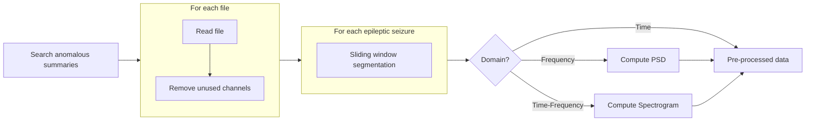
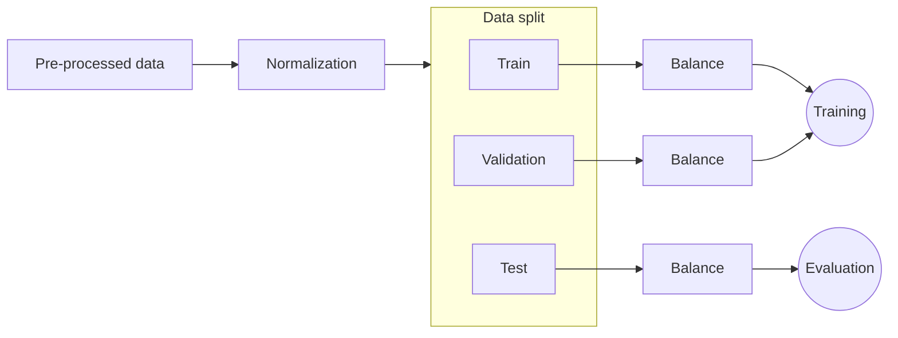

# Epileptic Seizure Detection in EEG

This project focuses on the detection of epileptic seizures in EEG data using various machine learning models. The models implemented aim to classify EEG signals using different data domains: temporal, frequency, and time-frequency.

## Table of Contents
- [Packages](#packages)
- [Database](#database)
- [Dataset](#dataset)
- [Pre-processing](#pre-processing)
- [Models and Training](#models-and-training)
- [Metrics](#metrics)
- [References](#references)
- [License](#license)

## Packages
The following Python libraries were used in this project:

- `wfdb` – For download dataset files and info.
- `Tensorflow` – For model training and evaluation.
- `MNE` – For EEG signal processing.
- `Keras Tuner` – For hyperparameter optimization.
- `PyQt` – Used to develop the front-end interface for the application.
- `sqlite3` - Used to store info on database.

## Graphical Application

TODO

## Datasets

### CHB-MIT

The dataset used in this work was the [CHB-MIT Scalp EEG Database](https://physionet.org/physiobank/database/chbmit/) from PhysioNet [1]. The exams in this dataset were generated at Boston Children's Hospital. All patients were monitored at a sampling rate of 256 Hz with 16-bit quantization, and the electrodes were placed according to the 10–20 system of the International Federation of Clinical Neurophysiology ([IFCN](https://www.ifcn.info/)). The dataset contains information from 22 patients, where each case contains between 9 and 42 continuous samples from a single subject.

The dataset comes with a summary for each patient, containing crucial details about the exams, such as file name, start and end times, and the number of seizures. Given the complexity and volume of files, we opted for a database solution to streamline access and enhance readability of this information.

## Database

The database is created to store information about the datasets and training information.

### summary_info:

Used to store information about the files in the dataset.

| dataset_name | record_name | file_name | start_time | end_time | nr_occurrence | start_occurrence | end_occurrence | nr_channels | ds_channels | disease_type |
|---|---|---|---|---|---|---|---|---|---|---|
| CHBMIT | ch01 | chb01_01.edf | 12:34:22 | 13:13:07 | 2 | 1862, 2000 | 1963, 2213 | 24 | FP1-F7,F7-T7,... | epilepsy |

### metrics_info:

Used to store information about the training sessions of models.

| dataset_name | model_name | model_data_domain | model_window | accuracy | precision | sensitivity | specificity | true_positive_rate | false_positive_rate | f1_score |
|---|---|---|---|---|---|---|---|---|---|---|
| CHBMIT | CNN | Time | 5 | 0.876 | 0.876 | 0.876 | 0.876 | 0.876 | 0.876 | 0.876 |

## Pre-processing

The pre-processing step is segmented into two different phases: one for generating segmented domain data and the other for preparing the data for training, validation, and testing.

###  Generate segmented data:

- **Search anomalous summaries:** Search in the database for EEG files containing epileptic seizures.
  
- **For each file:** *(This steps are performed using multithreading for improved performance)*
  
  - **Read file:** Read the EEG file.
  
  - **Remove unused channels:** Eliminate any channels that are not required for analysis.

  - **Sliding window segmentation:** Segment the data into smaller windows. These segments are centered around seizures to optimize time and memory usage.

  - **Compute PSD (Power Spectral Density):** If the requested data is in the frequency domain, compute the Power Spectral Density (PSD) of each segment.

  - **Compute Spectrogram:** If the requested data is in the time-frequency domain, compute the spectrogram of each segment.

- **Pre-processed data:** Obtain the pre-processed data as the output of the entire process.

#### Adjust data for training:

- **Pre-processed data:** This represents the pre-processed data obtained from the previous stage of data pre-processing.

- **Normalization:** The pre-processed data is normalized to ensure that all features have a similar scale, which helps improve the convergence speed of the training algorithm and prevents any particular feature from dominating the learning process.
  
- **Data split:** The normalized data is split into three subsets: training data, validation data, and test data.

  - **Train:** This subset is used to train the machine learning model.

  - **Validation:** This subset is used to tune the hyperparameters of the model and to prevent overfitting.

  - **Test:** This subset is used to evaluate the performance of the trained model on unseen data.

- **Balance:** This step involves balancing the distribution of samples within the training data to prevent the model from being biased towards certain value.

- **Training:** This stage involves training the machine learning model using the balanced training data.

- **Evaluation:** After training, the model's performance is evaluated using the test datasets to acess its generalization ability and effectiveness.

## Models and Training

### Data Domains
The data will be processed and inserted into the models in three different domains:
- Temporal:
   - Raw EEG.

- Frequency:
   - Power Spectral Density - PSD.

- Time-frequency 
   - Spectrogram.

### Models:
- CNN (Convolutional Neural Network)
- RNN (Recurrent Neural Network)
- CRNN (Convolutional Recurrent Neural Network)

## Metrics:

A set of metrics was used to evaluate the performance of the models. For those metrics, we consider $TP$ for true positives, $TN$ for true negatives, $FN$ for false negatives, $FP$ for false positives, and $T$ as the total number of samples.

### Used Metrics:

| Metric          | Equation |
|:---------------:|:--------:|
| **Acuracy**     | $Acu = \frac{TP + TN}{T}$ |
| **Precision**   | $Pre = \frac{TP}{TP + FP}$ |
| **Sensitivity** | $Sen = \frac{TP}{FN + FP}$ |
| **Specificity** | $Spe = \frac{TN}{TN + FP}$ |
| **F1-Score**    | $F1 = \frac{2 \times Acu \times Sen}{Acu + Sen}$ |

### Models Evaluations:

TODO

## References

[1] Guttag J. CHB-MIT Scalp EEG Database (version 1.0.0). PhysioNet. 2010. Available from: https://doi.org/10.13026/C2K01R

## License

Copyright © 2024 [Luiz Antonio Nicolau Anghinoni](https://github.com/luizantoniona)
