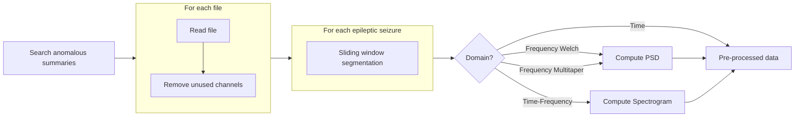

# Epileptic Seizure Detection in EEG

This project focuses on the detection of epileptic seizures in EEG data using various machine learning models. The models implemented aim to classify EEG signals using different data domains: temporal, frequency, and time-frequency.

## Table of Contents

- [Releases and Publications](#releases-and-publications)
- [Packages](#packages)
- [Graphical Application](#graphical-application)
- [Main Scripts](#main-scripts)
- [Datasets](#datasets)
- [Database](#database)
- [Preprocessing](#preprocessing)
- [Models and Training](#models-and-training)
- [Metrics](#metrics)
- [Evaluation Tables](#evaluation-tables)
- [References](#references)
- [License](#license)

## Releases and Publications

📌 **NOTE:** If you use this software in academic work, please cite the following papers:

### 🚀 Version 2.0 - Current main branch
- 💻 [Release v2.0.0-Final](https://github.com/luizantoniona/eeg-epileptic-seizure-detection/releases/tag/v2.0.0-Final)  
- 📄 **The use of multi-domain electroencephalogram representations in the building of models based on convolutional and recurrent neural networks for epilepsy detection**  
- 📅 **March 2025** — 🎓 *Master’s Thesis*  
- 📚 **Preprint DOI:** [10.48550/arXiv.2504.17908](https://doi.org/10.48550/arXiv.2504.17908)  
- 🔗 [Read on ResearchGate](https://www.researchgate.net/publication/391219682_The_use_of_Multi-domain_Electroencephalogram_Representations_in_the_building_of_Models_based_on_Convolutional_and_Recurrent_Neural_Networks_for_Epilepsy_Detection)
- How to Cite:
``` bibtex
@article{anghinoni2025use,
  title={The use of Multi-domain Electroencephalogram Representations in the building of Models based on Convolutional and Recurrent Neural Networks for Epilepsy Detection},
  author={Anghinoni, Luiz Antonio Nicolau and Denardin, Gustavo Weber and Gertrudes, Jadson Castro and Casanova, Dalcimar and Oliva, Jefferson Tales},
  journal={arXiv preprint arXiv:2504.17908},
  year={2025}
}
```

---

### 📌 Version 1.0  
- 💻 [Release v1.0.0-CBIS](https://github.com/luizantoniona/eeg-epileptic-seizure-detection/releases/tag/v1.0.0-CBIS)  
- 📄 **Detecção de epilepsia em eletroencefalogramas utilizando redes neurais convolucionais reduzidas**  
- 📅 **November 2024** — 📰 *Journal of Health Informatics*  
- 📚 **DOI:** [10.59681/2175-4411.v16.iEspecial.2024.1279](https://doi.org/10.59681/2175-4411.v16.iEspecial.2024.1279)  
- 🔗 [Read on ResearchGate](https://www.researchgate.net/publication/385979561_Deteccao_de_epilepsia_em_eletroencefalogramas_utilizando_redes_neurais_convolucionais_reduzidas)  
- How to Cite:
``` bibtex
@article{anghinoni2024detecccao,
  title={Detec{\c{c}}{\~a}o de epilepsia em eletroencefalogramas utilizando redes neurais convolucionais reduzidas},
  author={Anghinoni, Luiz Antonio Nicolau and Teixeira, Marcelo and de Castro Barbosa, Marco Antonio and Casanova, Dalcimar and Oliva, Jefferson Tales},
  journal={Journal of Health Informatics},
  volume={16},
  number={Especial},
  year={2024}
}
```

## Packages
The following Python libraries were used in this project:

- `wfdb` – For download dataset files and info.
- `Tensorflow` – For model training and evaluation.
- `MNE` – For EEG signal processing.
- `Keras Tuner` – For hyperparameter optimization.
- `PyQt` – Used to develop the front-end interface for the application.
- `sqlite3` - Used to store info on database.

## Graphical Application

The graphical application is developed using `PyQt` and provides an interface for users to interact with the EEG data, visualize results, and configure model parameters.

To run:
```
python3 main.py
```

## Main Scripts

These scripts serve as entry points for users who are not using the graphical interface, and provide utility tools to configure the dataset, manage the database, train models, and generate useful visualizations:

- **[Database Configuration](https://github.com/luizantoniona/eeg-epileptic-seizure-detection/blob/main/utils_configure.py)** — Initializes the database and processes metadata for the EEG recordings.
- **[Model Training](https://github.com/luizantoniona/eeg-epileptic-seizure-detection/blob/main/utils_train.py)** — Handles training of machine learning models using different data representations.

## Datasets

### CHB-MIT Scalp EEG Database

This project utilizes the [CHB-MIT Scalp EEG Database](https://physionet.org/physiobank/database/chbmit/) from PhysioNet [1]. The dataset was collected at Boston Children’s Hospital and includes EEG recordings from 22 pediatric patients with intractable seizures.

- **Sampling rate**: 256 Hz  
- **Resolution**: 16-bit  
- **Electrode placement**: 10–20 system (as defined by the [International Federation of Clinical Neurophysiology (IFCN)](https://www.ifcn.info/))

Each subject includes 9 to 42 EEG recordings, with seizure occurrences annotated. A summary file is provided per patient with key metadata such as seizure start times, durations, and file identifiers.

Due to the volume and complexity of the files, a database solution is employed to streamline access and improve the management of seizure metadata across subjects.

## Database

The database is implemented using `sqlite3` and stores information about the EEG files, including metadata and seizure annotations. The database schema is designed to facilitate efficient querying and retrieval of data for preprocessing and model training.


### summary_info:

Used to store information about the files in the dataset.

| dataset_name | record_name | file_name | start_time | end_time | nr_occurrence | start_occurrence | end_occurrence | nr_channels | ds_channels | disease_type |
|---|---|---|---|---|---|---|---|---|---|---|
| CHBMIT | ch01 | chb01_01.edf | 12:34:22 | 13:13:07 | 2 | 1862, 2000 | 1963, 2213 | 24 | FP1-F7,F7-T7,... | epilepsy |

### metrics_info:

Used to store information about the training sessions of models.

| dataset_name | model_name | model_data_domain | model_window | accuracy | precision | sensitivity | specificity | true_positive_rate | false_positive_rate | f1_score |
|---|---|---|---|---|---|---|---|---|---|---|
| CHBMIT | CNN | Time | 5 | 0.876 | 0.876 | 0.876 | 0.876 | 0.876 | 0.876 | 0.876 |

## Preprocessing

###  Generate segmented data:

- **Search anomalous summaries:** Search in the database for EEG files containing epileptic seizures.
  
- **For each file:** *(This steps are performed using multithreading for improved performance)*
  
  - **Read file:** Read the EEG file.
  
  - **Remove unused channels:** Eliminate any channels that are not required for analysis.

  - **Sliding window segmentation:** Segment the data into smaller windows. These segments are centered around seizures to optimize time and memory usage.

  - **Compute PSD (Power Spectral Density):** If the requested data is in the frequency domain, compute the Power Spectral Density (PSD) of each segment.

  - **Compute Spectrogram:** If the requested data is in the time-frequency domain, compute the spectrogram of each segment.

- **Pre-processed data:** Obtain the pre-processed data as the output of the entire process.



#### Adjust data for training:

- **Pre-processed data:** This represents the pre-processed data obtained from the previous stage of data pre-processing.

- **Normalization:** The pre-processed data is normalized to ensure that all features have a similar scale, which helps improve the convergence speed of the training algorithm and prevents any particular feature from dominating the learning process.
  
- **Data split:** The normalized data is split into two subsets: training data, and test data.

  - **Train:** This subset is splited in 80% used to train the machine learning model, and 20% to tune the hyperparameters.

      - **20%:** Used for hyperparameter tuning

      - **64%:** Used for training

      - **16%:** Used for validations

  - **Test:** This subset is used to evaluate the performance of the trained model on unseen data.

- **Hyperparameter tuning:** Optimization of model parameters to improve performance.

- **Training:** This stage involves training the machine learning model using the training data.

- **Evaluation:** After training, the model's performance is evaluated using the test datasets to acess its generalization ability and effectiveness.

## Models and Training

### Data Domains
The data will be processed and inserted into the models in three different domains:
- Temporal:
   - Raw EEG.

- Frequency:
   - Power Spectral Density - Welch method.
   - Power Spectral Density - Multitaper method.

- Time-frequency 
   - Spectrogram - Multitaper method.

### Models:
- CNN (Convolutional Neural Network)
- RNN (Recurrent Neural Network)
- CRNN (Convolutional Recurrent Neural Network)

## Metrics:

A set of metrics was used to evaluate the performance of the models. For those metrics, we consider $TP$ for true positives, $TN$ for true negatives, $FN$ for false negatives, $FP$ for false positives, and $T$ as the total number of samples.

### Used Metrics:

| Metric          | Equation |
|:---------------:|:--------:|
| **Acuracy**     | $Acu = \frac{TP + TN}{T}$ |
| **Precision**   | $Pre = \frac{TP}{TP + FP}$ |
| **Sensitivity** | $Sen = \frac{TP}{FN + FP}$ |
| **Specificity** | $Spe = \frac{TN}{TN + FP}$ |
| **F1-Score**    | $F1 = \frac{2 \times Acu \times Sen}{Acu + Sen}$ |

## Evaluation Tables:

### Evaluation of RNN

| **Metric**   | **Window** | **Time**            | **Welch**          | **Multitaper**     | **Spectrogram**     |
|--------------|------------|---------------------|--------------------|--------------------|---------------------|
| **Accuracy** | 1s         | 78.49±2.43          | 84.78±0.46         | **87.86±0.49**     | 83.47±1.48          |
|              | 2s         | 79.74±1.66          | 85.40±0.37         | **91.65±0.56**     | 83.73±1.71          |
|              | 5s         | 77.29±0.84          | 92.96±0.49         | **95.99±0.19**     | 80.91±1.10          |
|              | 10s        | 76.83±1.78          | 96.18±0.43         | **97.05±0.24**     | 79.67±2.08          |
|||||||
| **Precision**| 1s         | 79.26±3.30          | 85.64±2.02         | **89.45±1.54**     | 86.61±2.90          |
|              | 2s         | 80.45±4.41          | 87.21±1.20         | **93.39±1.18**     | 85.09±2.15          |
|              | 5s         | 75.06±4.41          | 94.09±1.22         | **96.59±0.58**     | 82.08±3.30          |
|              | 10s        | 78.58±4.42          | 97.37±0.59         | **97.55±0.53**     | 81.53±3.89          |
|||||||
| **Sensitivity**| 1s       | 78.10±2.92          | 84.07±1.42         | **86.58±1.17**     | 81.37±1.79          |
|              | 2s         | 79.11±2.30          | 84.20±1.15         | **90.28±1.22**     | 82.88±2.10          |
|              | 5s         | 78.98±3.05          | 92.04±1.31         | **95.44±0.70**     | 80.19±2.57          |
|              | 10s        | 75.50±3.16          | 94.96±0.77         | **96.47±0.52**     | 78.17±3.89          |
|||||||
| **Specificity**| 1s       | 79.05±2.78          | 85.61±1.50         | **89.27±1.27**     | 85.97±2.49          |
|              | 2s         | 80.69±3.06          | 86.75±0.87         | **93.17±1.06**     | 84.70±1.99          |
|              | 5s         | 76.17±2.34          | 93.99±1.11         | **96.56±0.54**     | 81.95±2.20          |
|              | 10s        | 78.73±2.56          | 97.42±0.56         | **97.62±0.50**     | 81.74±2.41          |
|||||||
| **F1-Score** | 1s         | 78.29±2.59          | 84.41±0.83         | **87.21±0.74**     | 82.40±1.50          |
|              | 2s         | 79.41±1.73          | 84.79±0.72         | **90.96±0.83**     | 83.30±1.85          |
|              | 5s         | 78.10±1.72          | 92.50±0.85         | **95.71±0.42**     | 80.53±1.70          |
|              | 10s        | 76.15±2.38          | 95.56±0.57         | **96.76±0.33**     | 78.89±2.08          |

### Evaluation of CNN

| **Metric**   | **Window** | **Time**        | **Welch**       | **Multitaper**       | **Spectrogram**      |
|--------------|------------|-----------------|-----------------|----------------------|----------------------|
| **Accuracy** | 1s         | 82.01±0.81      | 84.70±0.32      | **88.51±0.24**       | 84.04±0.57           |
|              | 2s         | 83.59±0.55      | 88.95±0.37      | **93.61±0.32**       | 89.20±0.35           |
|              | 5s         | 86.71±0.47      | 94.07±0.26      | **96.82±0.24**       | 86.34±0.64           |
|              | 10s        | 83.19±0.58      | 96.03±0.24      | **97.63±0.16**       | 87.12±1.84           |
|||||||
| **Precision**| 1s         | 84.39±1.84      | 86.93±0.87      | **89.76±1.57**       | 87.71±1.92           |
|              | 2s         | 88.28±2.64      | 91.34±0.80      | **93.65±0.77**       | 91.54±1.08           |
|              | 5s         | 91.11±1.22      | 95.24±0.77      | **97.91±0.36**       | 93.02±1.92           |
|              | 10s        | 84.93±2.24      | 97.43±0.42      | **97.85±0.36**       | 91.62±5.69           |
|||||||
| **Sensitivity**| 1s         | 80.44±1.71      | 83.06±0.59      | **87.47±1.32**       | 81.62±1.75           |
|              | 2s         | 80.77±1.42      | 87.19±0.74      | **93.58±0.60**       | 87.46±1.04           |
|              | 5s         | 83.76±1.15      | 93.07±0.56      | **95.82±0.55**       | 82.02±1.70           |
|              | 10s        | 81.61±1.92      | 94.62±0.34      | **97.33±0.43**       | 83.84±3.30           |
|||||||
| **Specificity**| 1s         | 83.84±1.26      | 86.49±0.70      | **89.66±1.24**       | 86.96±1.48           |
|              | 2s         | 87.18±2.15      | 90.91±0.70      | **93.65±0.69**       | 91.15±0.92           |
|              | 5s         | 90.29±1.06      | 95.14±0.72      | **97.87±0.35**       | 92.12±1.79           |
|              | 10s        | 85.00±1.50      | 97.46±0.40      | **97.93±0.34**       | 91.70±4.79           |
|||||||
| **F1-Score** |  1s         | 81.21±1.20      | 83.87±0.40      | **87.98±0.74**       | 82.81±1.15           |
|              | 2s         | 82.15±0.82      | 88.06±0.52      | **93.59±0.39**       | 88.32±0.66           |
|              | 5s         | 85.21±0.78      | 93.56±0.33      | **96.32±0.38**       | 84.12±1.15           |
|              | 10s        | 82.38±1.21      | 95.32±0.26      | **97.48±0.27**       | 85.41±2.19           |


### Evaluation of CRNN

| **Metric**   | **Window** | **Time**            | **Welch**          | **Multitaper**     | **Spectrogram**     |
|--------------|------------|---------------------|--------------------|--------------------|---------------------|
| **Accuracy** | 1s         | 81.93±0.55          | 84.73±0.36         | **88.21±0.32**     | 84.11±0.74          |
|              | 2s         | 85.63±0.57          | 87.01±0.48         | **92.38±0.37**     | 88.28±0.69          |
|              | 5s         | 88.27±1.48          | 93.38±0.25         | **95.88±0.32**     | 86.11±0.66          |
|              | 10s        | 90.08±1.64          | 95.54±0.49         | **96.87±0.32**     | 86.74±1.56          |
|||||||
| **Precision**| 1s         | 86.66±2.57          | 86.27±1.45         | **89.94±1.65**     | 91.05±1.29          |
|              | 2s         | 88.19±3.49          | 88.48±0.93         | **93.15±0.84**     | 91.65±1.90          |
|              | 5s         | 91.69±1.31          | 93.60±1.16         | **97.13±0.67**     | 88.37±3.14          |
|              | 10s        | 93.43±3.41          | 96.07±0.86         | **97.98±0.47**     | 88.21±4.31          |
|||||||
| **Sensitivity**| 1s       | 79.09±1.98          | 83.57±1.26         | **86.84±1.12**     | 79.84±1.41          |
|              | 2s         | 84.01±1.86          | 85.97±1.02         | **91.75±0.69**     | 85.91±1.53          |
|              | 5s         | 85.88±2.27          | 93.21±0.97         | **94.76±0.45**     | 84.82±1.49          |
|              | 10s        | 87.28±1.90          | 94.90±0.85         | **95.74±0.73**     | 85.27±2.23          |
|||||||
| **Specificity**| 1s       | 85.57±1.91          | 86.03±1.00         | **89.75±1.35**     | 89.78±1.13          |
|              | 2s         | 87.73±2.69          | 88.14±0.74         | **93.05±0.75**     | 91.11±1.66          |
|              | 5s         | 91.10±1.26          | 93.61±1.04         | **97.07±0.65**     | 87.78±2.58          |
|              | 10s        | 93.37±3.14          | 96.19±0.79         | **98.02±0.44**     | 88.59±3.44          |
|||||||
| **F1-Score** | 1s         | 80.48±1.26          | 84.14±0.76         | **87.52±0.61**     | 81.92±1.07          |
|              | 2s         | 84.80±0.86          | 86.49±0.71         | **92.06±0.47**     | 87.08±1.02          |
|              | 5s         | 87.06±1.85          | 93.29±0.53         | **95.32±0.32**     | 85.45±0.69          |
|              | 10s        | 88.65±1.55          | 95.22±0.61         | **96.30±0.50**     | 85.98±1.56          |


## References

[1] Guttag J. CHB-MIT Scalp EEG Database (version 1.0.0). PhysioNet. 2010. Available from: https://doi.org/10.13026/C2K01R

## License

- This work is licensed under the Creative Commons Attribution 4.0 International License.  
- To view a copy of this license, visit http://creativecommons.org/licenses/by/4.0/.

Copyright © 2025 [Luiz Antonio Nicolau Anghinoni](https://github.com/luizantoniona)
